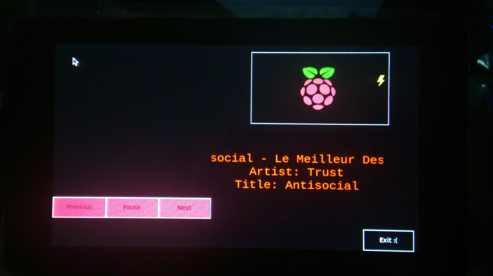

# carPI-By-Paul This Raspbian GUI for car with touchscreen for manage song's. Bluetooth in CAR (Previous,Pause,Next,title...)
## VERSION 1 ##
This APP is GUI for car with touchscreen for manage song's. Bluetooth in CAR (Previous,Pause,Next,title...)

### It's my first application ###
pre-requisite :
A Screen 800x480 or modify resolution in "carPI.py"
My touchscreen : https://www.kubii.fr/ecrans-afficheurs/2331-ecran-tactile-7-800x480-kubii-3272496012523.html

- Raspberry-PI 4
- Tkinter, python2
- bluetoothctl
- Audiopulse
- Jack-Socket

HOW TO INSTALL :

"sudo apt-get update && sudo apt-get install bluez pulseaudio-module-bluetooth python-gobject python-gobject-2"

"sudo apt-get install python-tk"

"sudo usermod -a -G lp pi"

"sudo nano /etc/bluetooth/audio.conf"

"Enable=Source,Sink,Media,Socket"

"sudo nano /etc/pulse/daemon.conf"
Add the following line after the commented example ";resample-method = speex-float-3" (don't use the ";" symbol which indactes a commented setting) : 

"resample-method = trivial"

start service:
"pulseaudio -D"
"systemctl start bluetooth"

Run the interface :
"python ./carPI.py" 

#Better to run when RASP GUI run :
sudo nano /etc/xdg/lxsession/LXDE-pi/autostart

ADD THIS IN THE FILE :
"@lxpanel --profile LXDE-pi"
"@pcmanfm --desktop --profile LXDE-pi"
"@xscreensaver -no-splash"
"bash /home/pi/car-run.sh"
"point-rpi"
